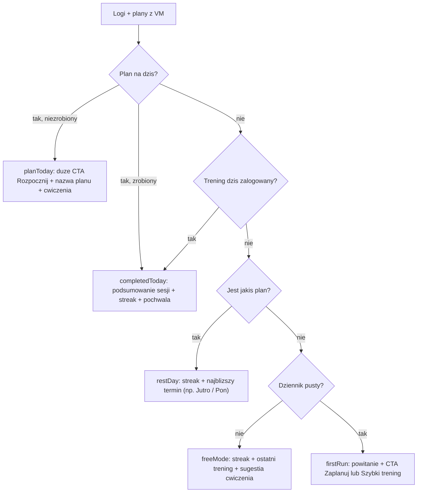

# Kontekstowy hero na Home (Sprinty H1–H3)

## Zasady dla agentów (obowiązkowe)

1. **NIE uruchamiać `xcodebuild`** ani żadnej weryfikacji kompilacji — build i testy sprawdza wyłącznie użytkownik ręcznie w Xcode.
2. **Wykonujesz TYLKO swój sprint.** Który jest twój — sprawdź w **[docs/SPRINTS-HOME.md](docs/SPRINTS-HOME.md)** (osobny tracker tego planu — już istnieje). Jeśli poprzedni sprint ma status `do weryfikacji` — ZATRZYMAJ SIĘ i poproś użytkownika o build w Xcode.
3. **Przed startem** przeczytaj cały ten plan + WSZYSTKIE wpisy w dzienniku `docs/SPRINTS-HOME.md` + notatki końcowe w [docs/SPRINTS.md](docs/SPRINTS.md) (kontekst Sprintów 1–8).
4. **Po sprincie obowiązkowo**: (a) statusy swoich todos w tym pliku na `completed`, (b) wpis w dzienniku `docs/SPRINTS-HOME.md` wg szablonu (zrobione / odstępstwa / decyzje / znane problemy / wskazówki dla następnego / do ręcznej weryfikacji), (c) status sprintu na `do weryfikacji` — na `zakończony` zmienia użytkownik po buildzie.
5. Nowe pliki Swift kładź w katalogach synchronized groups (podpinają się same do targetu).

## Obowiązkowe skille (każdy agent czyta swoje PRZED kodem)

Pliki w `.agents/skills/` (projekt) i `~/.agents/skills/` (globalne):

- **Wszystkie sprinty**: `swift-architecture-skill` (MVVM fit jak dotąd — protokoły serwisów, DI przez `AppEnvironment`, `@Observable`), `swift-concurrency-pro` (uchwyty zadań, brak `DispatchQueue`, deterministyczne wstrzykiwanie daty/kalendarza).
- **H1**: `swift-testing-pro` (struktury, `#expect`/`#require`, testy parametryzowane `@Test(arguments:)`).
- **H2**: `swiftui-design-principles` (siatka 4/8, max stany fontów, semantyczne kolory z AppTheme, bez GeometryReader/fixed frames), `writing-for-interfaces` (copy PL: hierarchia, zero wypełniaczy, odmiana przez `PolishPlural`).
- **H3**: `swiftui-design-principles` + `writing-for-interfaces` + `swift-testing-pro` (smoke checklist) + `swift-security-expert` tylko jako bramka: żadnych sekretów w `UserDefaults`/plist (w tym sprincie nie dotykamy sekretów — preferencje modułów w UserDefaults są OK).

## Wymogi pod App Store review (obowiązują wszystkich)

- **Zero nowych uprawnień/entitlements** — ten plan ich nie potrzebuje; Review odrzuca uprawnienia bez realnego użycia (nauczka z notatek S4/S8: HealthKit/powiadomienia dodajemy dopiero z realnym kodem).
- **Dostępność**: każdy interaktywny element to `Button` z sensowną etykietą; dekoracyjne ikony `accessibilityHidden(true)`; hero jako całość ma czytelny `accessibilityLabel` per stan; animacje respektują Reduce Motion (`accessibilityReduceMotion`).
- **Dynamic Type**: żadnych `.font(.system(size:))` — style tekstu z AppTheme/systemowe; layout nie łamie się przy większych rozmiarach.
- **Zero deprecated API** w dotykanych plikach (`foregroundColor` → `foregroundStyle`, `cornerRadius` → `clipShape(.rect(cornerRadius:))`, dwuargumentowy `onChange`).
- **Copy**: poprawna polszczyzna, odmiana przez `PolishPlural`, daty przez `Text(_, format:)` — żadnego C-style formatowania.
- **Bez martwych/atrapowych elementów UI** — Review krzywo patrzy na przyciski bez akcji; każdy CTA w hero robi realną rzecz.

## Problem

[HeroCardView](cali-park/Features/Home/Views/Components/HeroCardView.swift) zawsze pokazuje to samo: powitanie + tygodniowe podciągnięcia + ring celu. Przy pustym dzienniku wygląda to jak "0 podciągnięć" — martwe i bez kontekstu. Home ma reagować na to, co się dzieje: plan na dziś, zrobiony trening, dzień przerwy.

## Stany hero

Powitanie zależne od pory dnia we wszystkich stanach ("Dzień dobry" / "Siema" / "Dobry wieczór" + imię z mocka — profil zostaje na sprint Profil). Tygodniowe podciągnięcia + ring **nie znikają** — schodzą do drugorzędnej linii/mini-ringu tam, gdzie pasują (completedToday, restDay, freeMode).

---

## Sprint H1 — fundament stanu (bez UI)

- **`planID: UUID?` w [WorkoutLogEntry](cali-park/Features/Exercises/Models/WorkoutLogEntry.swift)** — opcjonalny, wstecznie zgodny (`decodeIfPresent`, jak `sessionID` w S5). `QuickWorkoutViewModel` seedowany planem zapisuje go przy `finish()` — dzięki temu wiemy precyzyjnie, że dzisiejszy plan został wykonany, a nie tylko "coś dziś zalogowano".
- **`HomeHeroState`** — nowy enum (osobny plik w `Features/Home/Models/`) z case'ami: `planToday(plan:loggedTodayReps:)`, `completedToday(summary:streak:)`, `restDay(nextPlan:date:streak:)`, `freeMode(lastWorkout:suggestion:streak:)`, `firstRun`. `Equatable` (testy).
- **`HomeDashboardViewModel.heroState(asOf:)`** — czysta funkcja rozstrzygająca stan wg diagramu (jawna data + wstrzykiwany kalendarz, wzorzec `nextPlannedWorkout(asOf:)`). Reużywa istniejące: `nextPlannedWorkout`, `streak`, `latestWorkout`, `suggestedExercise`, `weeklyPullUps`.
- **Testy** (Swift Testing, parametryzowane, deterministyczny kalendarz UTC): plan dziś niezrobiony / plan dziś + sesja z `planID` / trening dziś bez planu / plan jutro / dziennik z historią bez planów / pusty dziennik; Codable `planID` (stare logi → `nil`); `finish()` zapisuje `planID`.

**Definition of done:** `heroState` przechodzi testy, zero zmian w UI.

## Sprint H2 — widoki hero + animacje + previews

- **`ContextualHeroView`** — głupi widok: dostaje `HomeHeroState` + closured akcje (`onStartPlan`, `onQuickWorkout`, `onPlanWorkout`). Per stan **osobne struktury widoków w osobnych plikach** (`Views/Components/Hero/` — np. `HeroPlanTodayView`, `HeroCompletedTodayView`, `HeroRestDayView`, `HeroFreeModeView`, `HeroFirstRunView`), wspólna rama karty. NIE podpinamy jeszcze do `HomeView` (to H3) — `HeroCardView` zostaje na razie nietknięty.
- **"Ruchome"**: przejścia między stanami przez `.transition` + `.animation` na zmianie stanu, `contentTransition(.numericText())` na liczbach, animowany ring, delikatny `PhaseAnimator` na ikonie CTA w `planToday` (puls). Wszystko wyłączane przy `accessibilityReduceMotion`. Bez GeometryReader, bez fixed frames.
- **Copy per stan** wg writing-for-interfaces (nagłówek niesie sedno; CTA to nazwana akcja: "Rozpocznij", "Zaplanuj trening", "Szybki trening").
- **Previews (mocki do oglądania w Xcode)**: `#Preview` per stan (stany podawane wprost jako wartości enuma) + jeden preview "galeria" ze wszystkimi stanami w ScrollView — użytkownik ogląda całość bez seedowania store'ów.

**Definition of done:** wszystkie stany hero da się obejrzeć w Xcode Previews, animacje działają, apka wygląda i działa jak przed sprintem (widoki jeszcze niezintegrowane).

## Sprint H3 — integracja + rail + bramka jakości

- **Integracja**: `ContextualHeroView` zastępuje `HeroCardView` w [HomeView](cali-park/Features/Home/Views/HomeView.swift); stan z `dashboard.heroState`; sheety akcji hero (start planu / szybki trening / edytor planu) na poziomie HomeView przez jeden enum `ActiveSheet` (`sheet(item:)`, wzorzec z S5 — nigdy dwa sheety naraz), `onDismiss` → `reload()`. `HeroCardView` do usunięcia.
- **[PrimaryActionRailView](cali-park/Features/Home/Views/Components/PrimaryActionRailView.swift)** — hero przejmuje kontekstowy start planu, więc drugi przycisk raila zmienia się na stałe wejście "Plany" (push `WorkoutPlansView` / edytor gdy brak planów); "Szybki trening" bez zmian.
- **Seedowane previews całego Home**: warianty `AppEnvironment.preview` z `InMemory*Store` (plan na dziś / sesja dziś zrobiona / pusty stan) — `HomeView` do obejrzenia w każdym scenariuszu.
- **Bramka jakości pod App Store** (checklist do odhaczenia we wpisie w dzienniku): dostępność (etykiety, Reduce Motion), Dynamic Type w największym rozmiarze, zero deprecated API w dotykanych plikach, każdy CTA ma realną akcję, copy PL spójne z resztą apki.
- **Testy**: nawigacja/akcje hero (VM: właściwa akcja dla właściwego stanu), regresja `heroState` po integracji (istniejące testy H1 muszą przechodzić bez zmian).

**Definition of done:** Home reaguje na kontekst (plan dziś → "Rozpocznij" prefilluje sesję; po zakończeniu sesji hero przechodzi w podsumowanie; brak planów + pusty dziennik → zaproszenie do startu), rail ma stałe wejście "Plany", checklist jakości odhaczona.

---

## Poza zakresem (świadomie, na osobne plany)

- **HealthKit / Apple Watch**: sklejanie sesji z treningiem odpalonym na zegarku (czas, kalorie, tętno z gotowego `HKWorkout` po zakończeniu). Wykonalne bez apki na watchOS — osobny plan, wymaga uprawnień HealthKit (dodawanych dopiero z realnym kodem).
- **Karta-zaproszenie na Insta/FB** (ImageRenderer + ShareLink: park, data, trening, lokalizacja) — osobny plan.
- Prawdziwe "kto dziś na trena" z RSVP — wymaga backendu (decyzja wciąż odłożona).
- Imię/cel tygodniowy z prawdziwego profilu — sprint Profil.

Weryfikacja końcowa (po H3): build + testy w Xcode (ręcznie, użytkownik) + smoke test: utwórz plan na dziś → hero pokazuje "Rozpocznij" → wykonaj sesję → hero przechodzi w podsumowanie dnia → następnego dnia (lub po usunięciu planów) odpowiedni stan przerwy/wolnego trybu.
