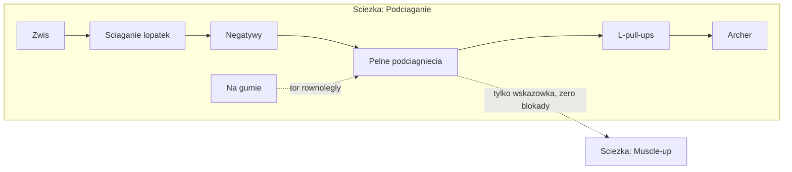

# Ścieżki progresji kalisteniki (Sprinty SK1–SK6)

## Po co i dlaczego tak

CaliPark jest dziś generycznym loggerem. Wyróżnik: kalistenika ma **naturalne drabiny progresji** — ale prawdziwe, nie wymyślone. Nie umiesz pompki → robisz je z kolan lub od ściany. Nie umiesz się podciągnąć → zwisy, ściąganie łopatek, negatywy, guma. Front lever to nie "odblokuj po podciągnięciach", tylko drabina tuck → advanced tuck → straddle → half-lay → full, mierzona w sekundach.

Kluczowe decyzje projektowe (poprawki po pierwszej wersji planu):

1. **Ścieżki (drabiny wariacji), nie płaskie drzewko ćwiczeń.** Każdy ruch bazowy to uporządkowana drabina od regresji do skilla, z uznanymi kryteriami przejścia. Treść NIE jest wyssana z palca — sprint SK1 kodyfikuje ją ze źródeł (poniżej) do `docs/PROGRESSIONS.md` z cytowaniami.
2. **Placement zamiast odblokowywania od zera.** Ktoś, kto robi 12 podciągnięć, nie może "odblokowywać" negatywów. Na welcome boardzie (i w apce dla istniejących użytkowników) krótka samoocena per ścieżka ustawia szczebel startowy — wszystko poniżej jest zaliczone z deklaracji. Celebracje dotyczą tylko realnych awansów od tego miejsca w górę.
3. **Ścieżki są w pełni niezależne i NIC nigdy nie jest zablokowane.** Skille są nierówne z natury — ktoś robi 70 podciągnięć i nie ma muscle-upa ani planche, bo to osobne tory (leverage/technika vs siła repowa). Dlatego: placement osobno per ścieżka, każdy szczebel każdej ścieżki jest zawsze widoczny, opisany, logowalny i ustawialny jako aktualny. Zależności między ścieżkami istnieją wyłącznie jako **niewiążące wskazówki** ("większość osób buduje muscle-upa na bazie pewnych podciągnięć i dipów") — nigdy jako warunek, kłódka czy bramka.
4. **Biblioteka pokazuje ruchy, ścieżka pokazuje warianty — zero zaśmiecania zakładki Ćwiczenia.** Wariacje progresji (pompki od ściany, z kolan, negatywy, tuck FL…) NIE są nowymi pozycjami na liście biblioteki. W katalogu dostają `variantOf: UUID` wskazujące ruch-rodzica (np. wszystkie warianty pompek → "Pompki"); lista i wyszukiwarka w zakładce Ćwiczenia pokazują wyłącznie ruchy główne (`variantOf == nil`) — biblioteka wygląda jak dziś. Warianty żyją w swoim naturalnym kontekście: na drabinie ścieżki w zakładce Skille oraz jako sekcja "Progresje" w detalu ruchu. Jedno źródło prawdy (jeden katalog, jedna przestrzeń UUID — logi i SetPad działają bez specjalnych przypadków), zero duplikatów: tam, gdzie szczebel drabiny to istniejące ćwiczenie (pełne podciągnięcia, dipy, muscle-up), ścieżka wskazuje istniejący UUID.

Zero backendu — wszystko liczone lokalnie z `WorkoutLogEntry`. Efekt uboczny: znikają dwie atrapy (zakładka Społeczność, hardkodowany moduł osiągnięć "12/30").

## Źródła treści (obowiązkowe dla SK1)

- **Recommended Routine, r/bodyweightfitness** (oficjalna wiki: redditbwf.github.io/wiki/recommended_routine.html + omówienie Antranika antranik.org/rr/): drabiny pull-up / row / push-up / dip / squat / core; zasada przejścia **3×8 czysto → następny szczebel** (start 3×5 na nowym).
- **Overcoming Gravity 2nd ed., Steven Low** (publiczne charty: calisthenics-101.co.uk "Overcoming Gravity 2 Charts"): drabiny statyk — back lever (german hang → skin the cat → tuck → adv tuck → straddle → half-lay → full), front lever (tuck → adv tuck → straddle/one-leg → half-lay → full), planche (frog stand → tuck → adv tuck → straddle → full), flagi, L-sit/V-sit; kryterium izometrii **3×20 s → następna wariacja**; rekomendowane bazy między ścieżkami (np. muscle-up zwykle po solidnych podciągnięciach i dipach) — u nas wyłącznie jako wskazówki, nie warunki.
- **Poradniki "first pull-up"** (m.in. protokoły dead hang → scapular pulls → negatywy → guma): potwierdzenie drabiny zero→jeden i roli gumy jako toru równoległego (nie obowiązkowego — negatywy są fundamentem, guma opcją sprzętową).

Agent SK1 ma obowiązek trzymać się tych drabin; każdy szczebel w `docs/PROGRESSIONS.md` dostaje źródło. Wątpliwości → wybieramy wersję z RR/OG, nie własną.

## Ścieżki (zakres v1)

Dynamiczne (kryterium przejścia: **3×8**), przykładowe szczeble:

- **Podciąganie**: zwis na drążku (sek) → ściąganie łopatek → negatywy → [guma — tor równoległy] → pełne podciągnięcia → L-pull-ups → archer pull-ups
- **Wiosłowanie**: incline rows → australijskie (horizontal rows) → wide rows → archer rows → tuck front lever rows (pomost do FL)
- **Pompki**: od ściany → na podwyższeniu → z kolan → pełne → diamentowe → pseudo-planche push-ups (pomost do planche)
- **Dipy**: podpór na poręczach (sek) → negatywy → dipy na poręczach → dipy na kółkach
- **Nogi**: przysiad z asystą → pełny przysiad → wykroki → step-upy → pistolet z asystą → pistolet
- **Core**: plank (sek) → unoszenie kolan w zwisie → unoszenie nóg w zwisie → toes-to-bar
- **Muscle-up** (wskazówka: większość buduje go na bazie pewnych podciągnięć i dipów — bez blokady): wysokie podciągnięcia (chest-to-bar) → negatywy MU → muscle-up z kipem → strict muscle-up

Statyki (kryterium: **3×20 s**, logowane w sekundach):

- **L-sit**: z podporem stóp → jedna noga → tuck L-sit → pełny L-sit
- **Front lever**: tuck → advanced tuck → straddle / one-leg → half-lay → full
- **Back lever**: german hang → skin the cat → tuck → advanced tuck → straddle → half-lay → full
- **Planche**: frog stand → tuck → advanced tuck → straddle → full
- **Human flag**: podpór na pionie → tuck flag → straddle flag → full flag
- **Stanie na rękach**: podpór przy ścianie (sek) → stanie przy ścianie → pompki w staniu przy ścianie

Sprzęt jako atrybut szczebla ("guma oporowa", "kółka", "poręcze", "drążek") — spójny ze stringami `Park.equipments`; guma tworzy tor równoległy, nie obowiązkowy.

Stany szczebla: **zaliczony** (z deklaracji placementu albo z logów), **aktualny** (tu trenujesz — pokazujemy postęp do kryterium, np. "3×8 — masz 3×6"), **przyszły** (widoczny, opisany, bez kłódek-blokad — drabina jest mapą i miernikiem, nie bramką; logować można wszystko, a "aktualny" szczebel można też ustawić ręcznie kalibracją).

XP/poziom: XP z każdego wpisu dziennika + bonusy za awanse szczebli; liczone **wstecz z całej historii**. Odznaki: definicje statyczne, spełnienie z logów (streaki, wolumeny, awanse) — koniec hardkodu.

## Zasady dla agentów (obowiązkowe — jak w poprzednich planach)

1. **NIE uruchamiać `xcodebuild`** — build i testy weryfikuje użytkownik ręcznie w Xcode.
2. **Wykonujesz TYLKO swój sprint** — który jest twój, sprawdź w **[docs/SPRINTS-SKILLS.md](docs/SPRINTS-SKILLS.md)** (osobny tracker tego planu — JUŻ ISTNIEJE: tabela statusów, instrukcja, tabela skilli per sprint, szablon dziennika). Poprzedni sprint `do weryfikacji` → STOP, poproś użytkownika o build.
3. **Przed startem** przeczytaj cały plan + WSZYSTKIE wpisy w dzienniku `docs/SPRINTS-SKILLS.md` + notatki końcowe w [docs/SPRINTS.md](docs/SPRINTS.md) i [docs/SPRINTS-HOME.md](docs/SPRINTS-HOME.md). Od SK2 wzwyż także `docs/PROGRESSIONS.md` (dokument-prawda treści, powstaje w SK1).
4. **Po sprincie**: todos na `completed`, wpis w dzienniku wg szablonu (zrobione / **zastosowane skille** / odstępstwa / decyzje / wskazówki / do weryfikacji), status `do weryfikacji`.
5. Nowe pliki Swift w katalogach synchronized groups. Architektura jak dotąd: MVVM (fit), protokoły + DI przez [cali-park/Core/AppEnvironment.swift](cali-park/Core/AppEnvironment.swift), `@Observable`, kolory tylko z AppTheme, jeden typ = jeden plik.

## Obowiązkowe skille (każdy agent czyta swoje PRZED pierwszą linią kodu)

Pliki w `.agents/skills/` (projekt) i `~/.agents/skills/` (globalne). To nie jest formalność — wpis w dzienniku musi zawierać punkt "Zastosowane skille" z konkretami. Mapa per sprint:

- **Wszystkie sprinty**:
  - `swift-architecture-skill` — MVVM (fit) jak dotąd: protokoły serwisów, DI przez `AppEnvironment`, `@Observable`, żadnych singletonów.
  - `swift-api-design-guidelines-skill` — ten plan tworzy dużo nowego publicznego API (modele, silnik, katalogi): nazwy jasne w miejscu użycia, funkcje bez side effectów jako rzeczowniki, boole jako asercje, komentarze dokumentacyjne przy każdej nowej deklaracji, etykiety argumentów wg gramatyki (wzór: `nextOccurrence(onOrAfter:calendar:)` z S6).
  - `swift-concurrency-pro` — deterministyczne wstrzykiwanie daty/kalendarza, uchwyty zadań z anulowaniem w VM (wzorzec `loadTask` ze stabilizacji), zero `DispatchQueue`, store'y za protokołami bez wyścigów.
  - `swift-testing-pro` — struktury nie klasy, `#expect`/`#require`, testy parametryzowane `@Test(arguments:)`, stuby wstrzykiwane (wzorzec `FailingWorkoutLogStore`), zero testów opartych o timing.
- **SK1 (treść + modele)**: dodatkowo `writing-for-interfaces` — nazwy i opisy szczebli w `docs/PROGRESSIONS.md` i katalogu to docelowe copy PL (zwięzłe, konkretne, bez żargonu tam, gdzie istnieje polskie słowo; terminy uznane — "tuck", "straddle" — zostają jako terms of art). `core-data-expert` jako **bramka decyzji o persystencji**: katalog i ścieżki są statycznym kodem, progres liczony z logów — świadomie ZERO Core Data/SwiftData; pusty `PersistenceController` zostaje nietknięty. Jeśli agent uzna, że potrzebna baza — STOP i pytanie do użytkownika, nie decyzja własna.
- **SK2 (SetPad sekundy)**: dodatkowo `swiftui-design-principles` — SetPad już trzyma siatkę 4/8 i limity fontów, tryb sekund nie może tego zepsuć; `writing-for-interfaces` — jednostka komunikowana jasno ("sekundy zwisu", "3 × 20 s"), odmiana przez `PolishPlural`, formatowanie przez `Text(_, format:)`/`Duration`, zero C-style formatów.
- **SK3 (silnik + placement)**: dodatkowo `swift-security-expert` jako **bramka storage**: placement/progres/XP to NIE sekrety — JSON w `documentsDirectory` i UserDefaults są OK; ale ZERO tokenów/credentials/sekretów w tych plikach ani w UserDefaults (gdy kiedyś wejdzie backend, tokeny tylko Keychain); żadnych flag "premium" persystowanych lokalnie. `core-data-expert` — ta sama bramka co SK1 (File store wg wzorca `FileWorkoutPlanStore`, nie Core Data).
- **SK4 (placement UI)**: dodatkowo `writing-for-interfaces` — pytania placementu to najważniejsze copy planu (proste, konkretne, jedna myśl na ekran, opcje jako realne liczby "0 / 1–4 / 5–8 / 9+", zero żargonu w pytaniach); `swiftui-design-principles` — onboarding czyszczony z `.font(.system(size:))`, arbitralnych paddingów i deprecated API; wybór jednokrotny jako jeden stan zaznaczenia, nie osobne toggle.
- **SK5 (zakładka Skille)**: dodatkowo `swiftui-design-principles` — najbardziej "designerski" sprint planu: siatka 4/8, max stany fontów, semantyczne kolory z AppTheme, bez GeometryReader/fixed frames (drabina przez layout, ewentualnie `Canvas` na połączenia), spójny styl ikon Watch; `writing-for-interfaces` — copy stanów szczebla, kryteriów ("3×8 — Twoje najlepsze: 3×6") i wskazówek bazy.
- **SK6 (nagroda + Home + bramka)**: wszystkie powyższe jako bramka końcowa; szczególnie `swift-concurrency-pro` (kolejka celebracji bez wyścigów — jeden strumień zdarzeń, nie rozproszone boole), `swift-testing-pro` (idempotencja celebracji), `swiftui-design-principles` + `writing-for-interfaces` (overlay celebracji: restraint — jedna czytelna informacja, nie fajerwerki tekstu), `swift-security-expert` + `core-data-expert` (audyt końcowy: żadnych sekretów w plikach/UserDefaults, Core Data nadal nietknięte).

**App Store**: zero nowych uprawnień; każdy interaktywny element to `Button` z etykietą; animacje respektują Reduce Motion; Dynamic Type bez `.font(.system(size:))`; zero deprecated API w dotykanych plikach; żadnych martwych CTA.

## Sprint SK1 — baza progresji: treść + modele (bez UI)

Największa wartość tego sprintu to **treść zgodna ze źródłami**, nie kod.

- **`docs/PROGRESSIONS.md`** — pełna specyfikacja wszystkich ścieżek: szczeble po polsku (nazwa, opis, wskazówki techniczne), kryterium przejścia per szczebel, sprzęt, niewiążące wskazówki między ścieżkami, **źródło per drabina** (RR wiki / OG charts / poradniki). To jest dokument-prawda dla kolejnych sprintów.
- **Rozszerzenie [ExerciseCatalog](cali-park/Features/Exercises/Services/ExerciseCatalog.swift)**: nowe wariacje jako `Exercise` (stałe UUID wg istniejącej konwencji `E0000000-…`; obecne 19 ID nietknięte — logi przeżywają). Szacunkowo ~40–50 nowych pozycji. Dwa nowe pola w `Exercise`, oba wstecznie zgodne (`decodeIfPresent` z defaultem): **`measurement: .reps / .seconds`** (default `.reps`) i **`variantOf: UUID?`** (default `nil`; każda wariacja wskazuje ruch-rodzica z dotychczasowej 19-tki — np. negatywy, guma i ściąganie łopatek → "Podciągnięcia"; tuck/straddle FL → "Front lever"; german hang i skin the cat → "Back lever"). Sprzęt "guma oporowa" dopisany do puli.
- **Biblioteka NIE puchnie**: `ExerciseLibraryViewModel` listuje i przeszukuje wyłącznie ruchy główne (`variantOf == nil`) — po tym sprincie zakładka Ćwiczenia (i `ExercisePickerSheet`, który reużywa ten VM) wygląda dokładnie jak przed nim, mimo ~70 pozycji w katalogu. Warianty są osiągalne wyłącznie przez ścieżki (SK5) i detal ruchu (SK5).
- **Modele** w `cali-park/Features/Skills/Models/`: `ProgressionPath` (id, nazwa PL, ikona, uporządkowane szczeble, opcjonalna `recommendedBase: String?` — czysto informacyjny tekst wskazówki, świadomie NIE relacja wymuszająca cokolwiek), `ProgressionStep` (`exerciseID`, kryterium przejścia, sprzęt, flaga toru równoległego), `AdvancementCriterion` (enum `Codable`: `.setsOfReps(sets:reps:)` np. 3×8, `.setsOfHold(sets:seconds:)` np. 3×20 s).
- **`ProgressionCatalog`** (`Services/`) — statyczna definicja wszystkich ścieżek 1:1 z `docs/PROGRESSIONS.md`.
- **Testy**: integralność (każdy szczebel wskazuje istniejące ćwiczenie; brak duplikatów; szczeble `.seconds` tylko dla ćwiczeń z `measurement == .seconds`; obecne 19 UUID niezmienione; każde `variantOf` wskazuje ruch główny z 19-tki, nigdy inną wariację — hierarchia płaska, jeden poziom; lista biblioteki po rozszerzeniu katalogu = dokładnie 19 ruchów).

**DoD:** `docs/PROGRESSIONS.md` kompletny ze źródłami, katalog i modele przechodzą testy, zakładka Ćwiczenia wygląda identycznie jak przed sprintem.

## Sprint SK2 — sekundy w dzienniku (statyki muszą być logowalne)

- **`LoggedSet.durationSeconds: Int?`** — wstecznie zgodny (jak `sessionID`/`planID`); dla izometrii `reps` = 1 techniczne, liczy się czas. Formatowanie PL ("20 s", "3 × 20 s") przez `Text(_, format:)` / `Duration`.
- **SetPad w trybie sekund**: `SetPadSheetView`/`SetPadEntryView` czytają `exercise.measurement` — dla `.seconds` ten sam keypad, ale wpisy to sekundy zwisu ("+" dodaje kolejny hold), nagłówek i copy jasno komunikują jednostkę. `SetPadInput` bez zmian (to czysty licznik liczb).
- **Historia + podsumowania**: wpisy czasowe wyświetlają się jako "3 × 20 s" w historii, sesjach i module Quick Log; suma sesji rozdziela powtórzenia i sekundy uczciwie (bez dodawania jabłek do gruszek).
- **Testy**: Codable roundtrip + wsteczna zgodność starych logów, zapis z SetPada w trybie sekund, formatowanie i odmiana PL.

**DoD:** da się zalogować "tuck front lever 3 × 15 s" z SetPada i zobaczyć to poprawnie w historii; stare logi działają bez zmian.

## Sprint SK3 — silnik progresu + placement (bez UI)

- **`SkillPlacement`** (`Models/`): zadeklarowany szczebel startowy per ścieżka + posiadany sprzęt (guma itd.) + data deklaracji. **`PlacementStoring`** + `FileSkillPlacementStore` (JSON w `URL.documentsDirectory`) + `InMemory…`; rejestracja w `AppEnvironment`.
- **`ProgressionEngine`** (`Services/`) — czyste funkcje, deterministyczne, wstrzykiwany kalendarz:
  - `pathStates(logs:placement:) -> [PathID: PathState]` — szczebel aktualny = max(deklaracja, wyliczone z logów); `PathState` niesie: zaliczone szczeble, aktualny, postęp do kryterium (np. najlepsze 3 serie z okna ostatnich sesji vs 3×8). Ścieżki liczone całkowicie niezależnie od siebie — stan jednej nigdy nie wpływa na drugą.
  - `xp(logs:)` + `PlayerLevel` (progi) — wstecz z całej historii; bonusy za awanse. **Deklaracja placementu NIE daje XP** (XP tylko z realnych logów — pro i tak szybko nadrobi wolumenem, a nie ma nagród za klikanie).
  - `earnedBadges(logs:pathStates:)` — odznaki (streaki, wolumeny, awanse, pierwszy pełny skill).
- **`SkillProgressStoring`** (jak w pierwszej wersji planu): JSON wyłącznie na "uczczone" awanse (celebracja odpala raz).
- **Testy** (parametryzowane, kalendarz UTC): wyznaczanie szczebla z logów (3×8 w jednej sesji vs rozbite), max(deklaracja, logi), kryteria czasowe 3×20 s, niezależność ścieżek (przypadek "70 podciągnięć, zero muscle-upa" — stan MU nieporuszony przez logi podciągnięć), XP wstecz, progi poziomów, odznaki, roundtrip store'ów.

**DoD:** silnik przechodzi testy; placement i logi zgodnie wyznaczają stan każdej ścieżki; zero zmian w UI.

## Sprint SK4 — placement UI: welcome board + kalibracja w apce

- **Przebudowa [OnboardingView](cali-park/Features/Onboarding/OnboardingView.swift)**: strona "Jaki jest Twój poziom?" (3 abstrakcyjne karty, odpowiedź dziś wyrzucana) zamienia się w **placement per ścieżka**: kilka szybkich pytań liczbowych ("Ile pełnych podciągnięć robisz w jednej serii?" 0 / 1–4 / 5–8 / 9+; analogicznie pompki, dipy, przysiady) + checkboxy umianych skilli (muscle-up, L-sit, tuck front lever…) + "Masz gumę oporową?". Odpowiedzi mapują się na szczeble startowe (mapowanie zdefiniowane w SK1/SK3, np. "0 podciągnięć" → start od negatywów; "9+" → archer). Wynik zapisany przez `PlacementStoring` — onboarding wreszcie coś robi. Strona celów zostaje; przy okazji dotknięte pliki czyścimy z deprecated API (`foregroundColor`, `cornerRadius`, `PreviewProvider`, `.font(.system(size:))`).
- **Kalibracja w apce**: ten sam formularz jako sheet — (a) pierwsze wejście do zakładki Skille bez placementu (istniejący użytkownicy nie przechodzą onboardingu ponownie), (b) "Ustaw poziom" per ścieżka w detalu ścieżki (SK5 podepnie wejście). Rekalibracja w dół nie kasuje szczebli zaliczonych z logów.
- **Testy**: mapowanie odpowiedzi → szczeble (parametryzowane), zapis/odczyt placementu, brak XP z deklaracji (regresja SK3).

**DoD:** świeży użytkownik po onboardingu ma sensowne szczeble startowe; istniejący dostaje kalibrację przy pierwszym kontakcie ze Skillami; pro deklarujący 12 podciągnięć startuje z drabiny od archera, nie od zwisu.

## Sprint SK5 — zakładka Skille (UI ścieżek)

- **Zamiana zakładki**: w [MainTabView](cali-park/Features/Main/MainTabView.swift) `Społeczność` → `Skille` (`CommunityView` zostaje w repo, znika z tab bara — wróci z backendem).
- **`SkillPathsViewModel`** (`@Observable`): stany ścieżek z `ProgressionEngine` (logi + placement), XP/poziom, świeże awanse.
- **`SkillPathsView`** — przegląd: nagłówek z poziomem i paskiem XP (`contentTransition(.numericText())`); karty ścieżek (nazwa, ikona `figure.*` w stylu Watch, aktualny szczebel, mini-postęp do następnego). Siatka 4/8, bez GeometryReader/fixed frames.
- **`PathDetailView`** — drabina pionowa: szczeble zaliczone (akcent) / aktualny (ring postępu + wyróżnienie) / przyszłe (przygaszone, ale opisane i tapowalne — mapa, nie kłódki; żadnych ikon blokady w całym UI). Wskazówka bazy jako neutralna adnotacja ("Zwykle buduje się na bazie podciągnięć i dipów"), nigdy jako warunek. Wejście "Ustaw poziom" (kalibracja z SK4).
- **`StepDetailSheetView`** — technika i wskazówki z katalogu, kryterium z realnym postępem ("3×8 — Twoje najlepsze: 3×6"), sprzęt, **CTA "Trenuj"** → `SetPadSheetView` dla tego ćwiczenia (tryb reps/sekundy z SK2).
- **Warianty w istniejących miejscach, bez bałaganu**: `ExerciseDetailView` ruchu głównego dostaje zwięzłą sekcję "Progresje" (link do drabiny ścieżki — nie listę wariantów inline); `ExercisePickerSheet` (szybki trening / edytor planu) nadal listuje tylko ruchy główne, a wybór konkretnego wariantu odbywa się drill-inem z poziomu ruchu (jeden dodatkowy krok tylko dla tych, którzy go potrzebują). Historia pokazuje nazwę wariantu — wpis "Negatywy podciągnięć 3×5" jest jednoznaczny.
- **Previews**: świeżak bez placementu / placement średniozaawansowany / weteran w połowie statyk — seedowane `InMemoryWorkoutLogStore` + `InMemorySkillPlacementStore`.
- **Testy**: VM — mapowanie stanów do prezentacji, wykrywanie świeżych awansów.

**DoD:** zakładka Skille pokazuje realne drabiny z realnym postępem; detal szczebla prowadzi do treningu właściwą jednostką.

## Sprint SK6 — pętla nagrody + Home + bramka jakości

- **Celebracja awansu**: zapis logu/sesji, który domyka kryterium szczebla lub próg poziomu → pełnoekranowy overlay (szczebel, ścieżka, XP; `PhaseAnimator`; Reduce Motion → wersja statyczna) + haptyka; raz per awans (stor z SK3), kolejka gdy kilka naraz. **Awanse z deklaracji placementu NIE celebrują.**
- **XP toast**: dyskretny "+34 XP" po każdym zapisie z SetPada/sesji.
- **Odznaki**: sekcja w zakładce Skille (zdobyte w akcencie, przyszłe wyszarzone z jawnym warunkiem) + celebracja.
- **[AchievementsModuleContent](cali-park/Features/Home/Views/Components/AchievementsModuleContent.swift)**: realne dane (poziom, XP do następnego, ostatni awans/odznaka), tap → zakładka Skille.
- **Hero — linia kontekstu** (bez zmiany maszyny stanów H1): w `freeMode`/`restDay` najbliższy cel progresji ("Jeszcze 2 powtórzenia do 3×8 — następny szczebel: pełne podciągnięcia").
- **Atrapy**: moduły leaderboard/feed domyślnie wyłączone z preferencji (czekają na backend).
- **Bramka jakości App Store** (checklist w dzienniku): dostępność (etykiety per stan szczebla, Reduce Motion), Dynamic Type max, zero deprecated API w dotykanych plikach, copy PL (`PolishPlural`, `Text(_, format:)`), każdy CTA działa.
- **Testy**: kolejka i idempotencja celebracji, brak celebracji z placementu, regresja `heroState` (testy H1 bez zmian).

**DoD:** trening domykający 3×8 → celebracja awansu + XP; Home żyje z tych samych danych; atrapy zniknęły z domyślnego UI.

## Poza zakresem (świadomie, na osobne plany)

- Backend/konta/sync — rankingi ścieżek między użytkownikami to naturalny krok PO tym planie.
- Karty-share na Insta (awans szczebla jako grafika, ImageRenderer + ShareLink) — mały plan zaraz po SK6; celebracja to gotowy hook.
- Wideo/animacje techniki per szczebel (dziś tekstowe instrukcje + SF Symbols; media to osobny temat licencyjny).
- Automatyczne sugerowanie planów treningowych z aktualnych szczebli (planer już istnieje — integracja "zbuduj plan z moich ścieżek" jako osobny, bardzo atrakcyjny plan).
- Dokończenie planu Profil + powiadomienia (S2–S4) — niezależny tor; placement trzymamy we własnym storze, więc nic tu na siebie nie czeka.

Weryfikacja końcowa (po SK6): build + testy w Xcode (ręcznie) + smoke: świeże konto → placement na welcome boardzie ("5–8 podciągnięć", "mam gumę") → zakładka Skille pokazuje właściwe szczeble → zaloguj 3×8 aktualnego szczebla → celebracja awansu → hero na Home podpowiada następny cel; istniejący użytkownik → kalibracja przy pierwszym wejściu w Skille, XP policzone wstecz z historii.
